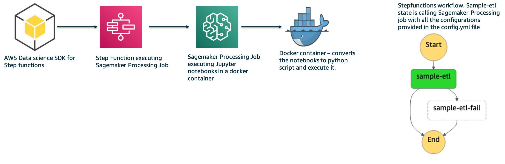

# aws-stepfunctions-sagemakerprocessingjob

Jupyter notebooks are widely used by Datascientists for their data transformation workloads. There are scenarios where the notebook needs to be scheduled and run in regular interval and they need to be productionize. 

This repo provides a framework for the Datascientists to productionize their workloads dynamically (based on the notebooks) using AWS Stepfunctions with Service Integration to Sagemaker Processing Job.

As a Data Scientist or Developer, you need to concentrate on developing the notebooks. The framework will help to productionize the notebooks using Stepfunctions as an orchestrator to execute your notebooks in Sagemaker Processing Job.

The repo is a template which you need to use and replace the notebooks with your notebooks and update the simple configuration file config.yml file. Based on the config.yml details, the stepfunctions with states for Sagemaker processing job for each notebook under src/notebooks is dynamically and programmatically created.

## Pre-requisites:

1. AWS Account and setup Access keys. The access id, secret key and region set as environment variables AWS_ACCESS_KEY_ID, AWS_SECRET_ACCESS_KEY and AWS_DEFAULT_REGION respectively.
2. AWS CLI2 installed already. 
3.  Docker (To do build)

## Architecture

## Usage
To try out the framework and see its work in action, do the following:

1. Clone the repo. **git clone https://gitlab.aws.dev/govindhi/aws-stepfunctions-sagemakerprocessingjob-dynamicinput.git**
2. cd aws-stepfunctions-sagemakerprocessingjob-dynamicinput
3. Update the config.yml accordingly.
4. Create virtual env using the command,  **python3 -m venv venv**
5. Activate, the venv using the command, **source  venv/bin/activate**
6. Install the dependent python modules required using the command **pip install -r venv_requirement.txt**
7. Set the environment variables Example: export AWS_DEFAULT_REGION=us-west-1, export AWS_ACCESS_KEY_ID=your access key id, export AWS_SECRET_ACCESS_KEY=your access key
8. Provide executable permission , **chmod +x deploy.sh** 
9. Execute script **./deploy.sh**
10. Login to the AWS Console, Goto Step functions, Statemachines. You would be able to see state machine created dynamically based on the information from config.yml. 

## User-Experience

The users who want to on-board this framework to productionize their notebook, need to do the following:

* Clone the repo
* Place your jupyter notebooks at src/notebooks. Remove sample notebook from src/notebooks and csv file from src/data. If there are mulitple notebooks to be executed sequentially,
then, name the notebook in alphabetical order. Example: a-nb.ipynb, a-nb.ipynb.
* If your notebooks requires any 3rd party python modules, specify them in the requirements.txt
* Update the config.yml file accordingly.
    * Specify the basic items required like instance type, volume size (in GB) and the max run time in the keys instance_type, volume_size and max_runtime.
    * If you want Sagemaker processing job to spin the instance in a VPC, please provide Subnet Ids and Security group accordingly in the keys subnets and security_groups.
    * In addition to the above, the framework supports other keys that include:
        * *container_endpoint* - In case, if you want to execute your own scripts (it can be anyother normal custom python script as well), please provide so. 
          *Example:  container_endpoint: "python3 deepprofiler --root=/opt/ml/processing/input --config=config.json train"*
        * *s3_input*: If your script needs to copy data from s3 to local container, sagemaker processing job is executing, please provide the s3 path accordingly.
          *Example: s3_input: "s3://my-input-sm-bucket"*
        * *container_input*: The path in the container from where the s3_input data need to be copied to.
          *Example: container_input: "/opt/ml/processing/input"*
        * *container_output*: The path in the container from where the data output by the execution of script provided in the container endpoint need to be copied to s3_output
          *Example: container_output: "/opt/ml/processing/input/results_from_execution"*
        * *s3_output*: The S3 path where the contents from containe_output path copied to S3 Location. *Example: s3_input: "s3://my-output-sm-bucket"*
* Follow the steps 4 to 10 from Usage section.

## Note

The dataset (US States 2010 and 2020 population) used in this repo is obtained from Wikipedia - https://en.wikipedia.org/wiki/List_of_U.S._states_and_territories_by_population

## Security

See [CONTRIBUTING](CONTRIBUTING.md#security-issue-notifications) for more information.

## License

This library is licensed under the MIT-0 License. See the LICENSE file.

